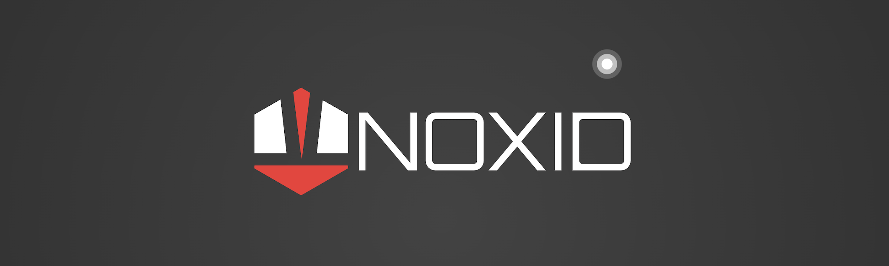

#  iWeatherApp (UIKit)

# Summary

iWeatherApp is a simple and intuitive weather application that provides users with accurate and up-to-date weather information using OpenWeather API. With a sleek and modern design, iWeatherApp offers a seamless user experience and a range of advanced features.

One of the standout features of iWeatherApp is its support for Dark Mode, allowing users to switch between light and dark themes according to their preference. The app's clean and visually appealing interface, coupled with vector images, ensures a crisp and visually stunning experience on any device.

iWeatherApp leverages the UITextField and Delegate pattern to enable user input and interaction. The app's intelligent use of Swift protocols and extensions enhances code modularity and maintainability, allowing for easy customisation and extension of functionality.

Swift's guard keyword is utilised in iWeatherApp to ensure robust error handling and graceful fallback options, ensuring a smooth user experience even in unexpected scenarios. The app also leverages Swift computed properties to efficiently calculate and provide real-time weather data.

With the help of Swift closures and completion handlers, iWeatherApp seamlessly integrates with URLSession to make HTTP requests and fetch weather data from remote servers. The app utilises the native Encodable and Decodable protocols to parse JSON responses, making data retrieval and processing straightforward and efficient.

iWeatherApp employs Grand Central Dispatch to efficiently manage concurrent operations, particularly when fetching data and updating the main thread. This ensures that the app remains responsive and delivers a seamless user experience.

Core Location integration allows iWeatherApp to access the device's GPS capabilities, providing location-specific weather information. Users can easily view weather forecasts and conditions for their current location or any desired location.

Following the MVC (Model-View-Controller) design pattern, iWeatherApp maintains a clear separation between the data model, the presentation layer, and the business logic. This architectural approach promotes code organisation, reusability, and scalability, making it easier to maintain and expand the app in the future.

Overall, iWeatherApp combines cutting-edge technologies and design principles to offer users a feature-rich, visually appealing, and reliable weather application.

## Key Features Used

* UIKit
* Dark-mode
* OpenWeather API
* Core Location
* MVC Design pattern

